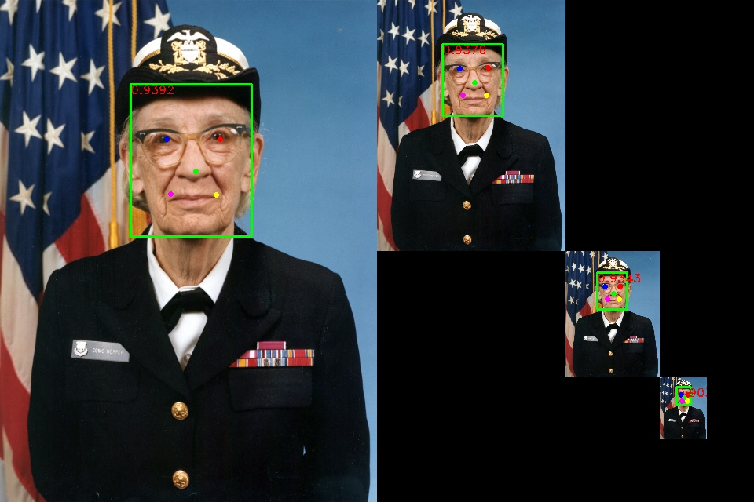
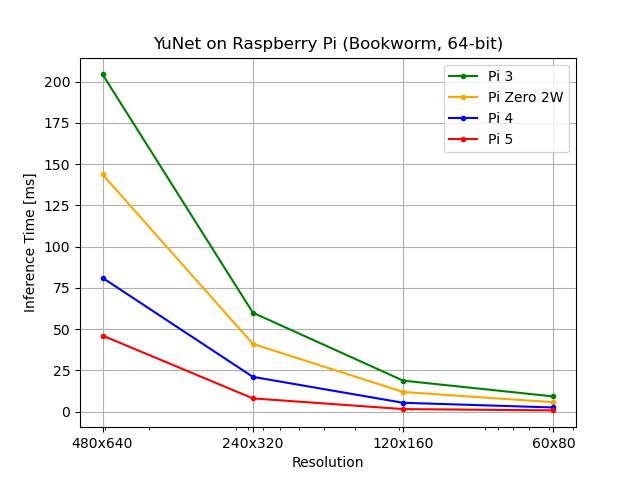
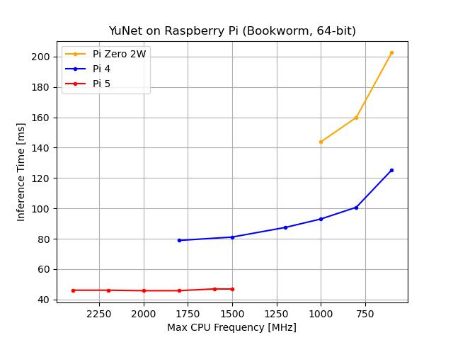
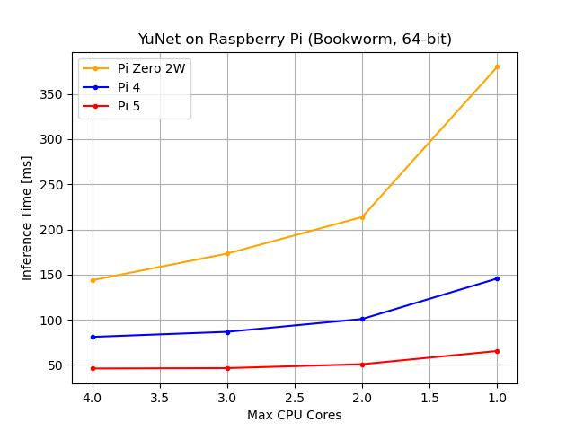

# Raspberry Pi YuNet Benchmarking

## Model
We used the model [face_detection_yunet_2023mar.onnx](models/face_detection_yunet_2023mar.onnx) from the [OpenCV Zoo](https://github.com/opencv/opencv_zoo) with git tag [4.10.0](https://github.com/opencv/opencv_zoo/tree/4.10.0). This model is based on [libfacedetection](https://github.com/ShiqiYu/libfacedetection) by [Shiqi Yu](https://github.com/ShiqiYu).

OpenCV Zoo is licensed under the [Apache-2.0 license](models/LICENSE) and its license file is provided in the models directory.

## Image
We used the image [NH 96919-KN.jpeg](images/NH%2096919-KN.jpeg) of Grace Hopper from [Navy History and Heritage Command](https://www.history.navy.mil/content/history/nhhc/our-collections/photography/numerical-list-of-images/nhhc-series/nh-series/NH-96000/NH-96919-KN.html).

- Title: Commodore Grace M. Hopper, USNR
- Caption: Official portrait photograph of Commodore Grace M. Hopper, USNR. Original photo number DN-SC-84-05970.
- Accession #: NH
- Catalog #: NH 96919-KN
- Copyright Owner: Defense Imagery
- Original Creator: James S. Davis
- Original Date: 1984-01-20
- Original Format: Color photograph

## Raspberry Pi
### Hardware
Four different Raspberry Pi boards were tested:
- [Raspberry Pi 5 Model B Rev 1.0](https://www.raspberrypi.com/products/raspberry-pi-5/)
- [Raspberry Pi 4 Model B Rev 1.1](https://www.raspberrypi.com/products/raspberry-pi-4-model-b/)
- [Raspberry Pi Zero 2 W Rev 1.0](https://www.raspberrypi.com/products/raspberry-pi-zero-2-w/)
- [Raspberry Pi 3 Model B Rev 1.2](https://www.raspberrypi.com/products/raspberry-pi-3-model-b/)

### Operating System
[Raspberry Pi OS Lite](https://downloads.raspberrypi.com/raspios_lite_arm64/images/raspios_lite_arm64-2024-11-19/)
- Release date: November 19th 2024
- System: 64-bit
- Kernel version: 6.6
- Debian version: 12 (bookworm)
- Size: 438MB

## Testing YuNet
The model was tested at four different resolutions:
- 480x640
- 240x320
- 120x160
- 60x80

    

## Resolution vs Inference Time

    

## CPU Frequency vs Inference Time

    

## Number of CPU Cores vs Inference Time

    

